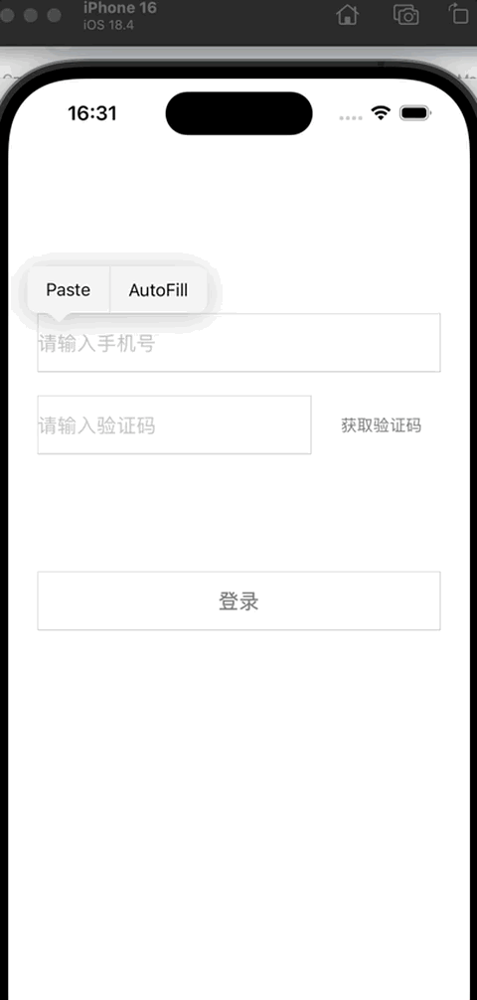
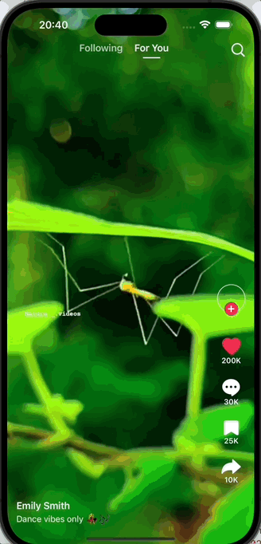
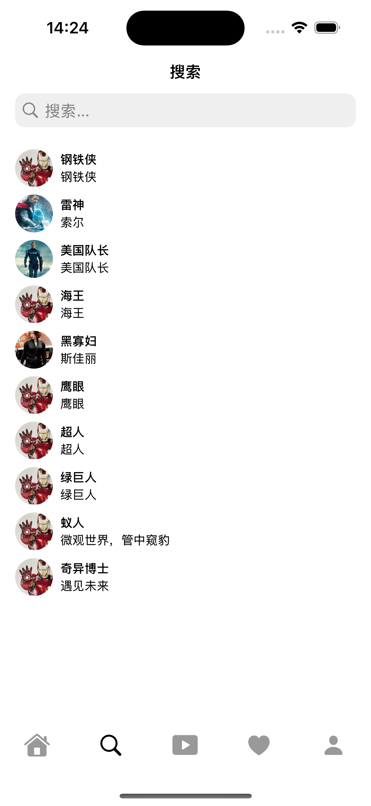
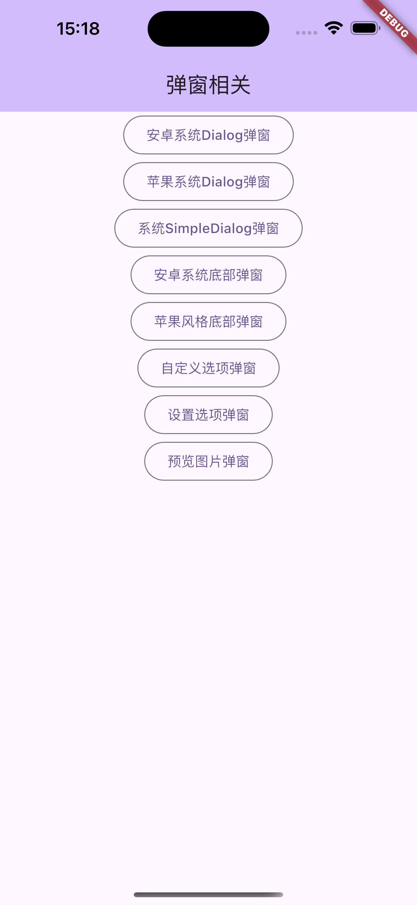
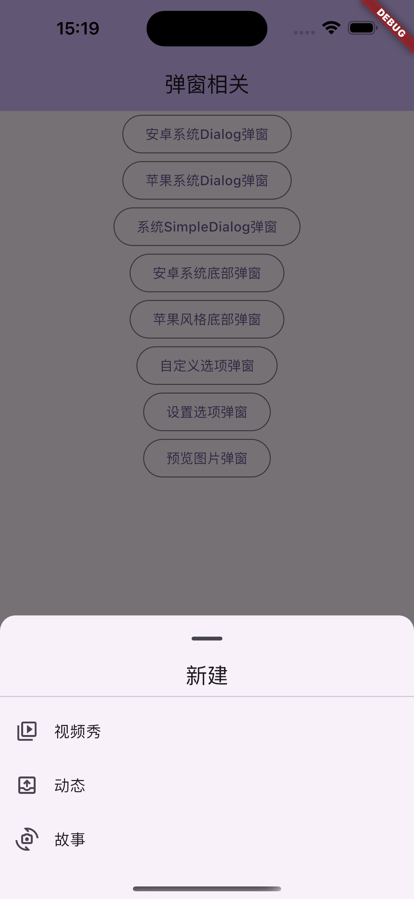
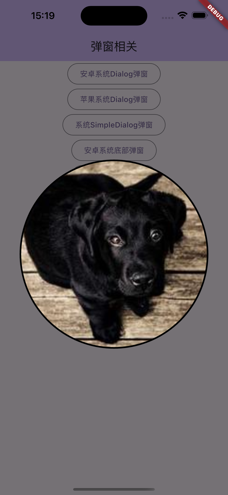
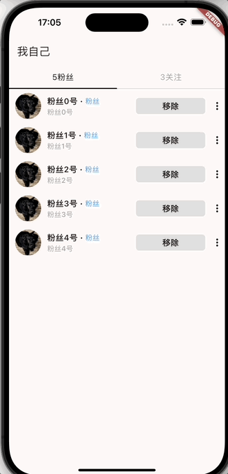
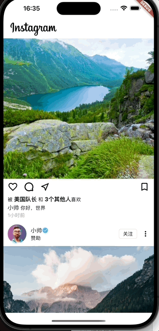
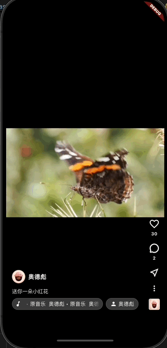
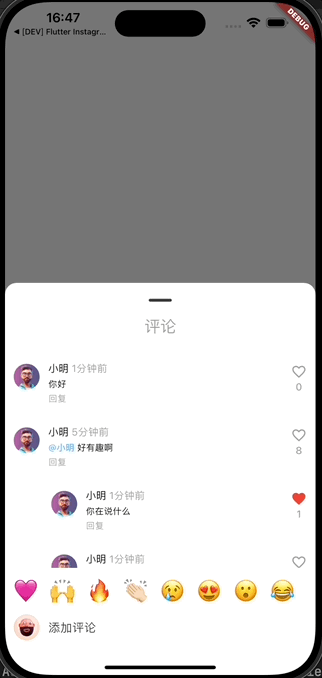

# 🚀 Flutter × iOS Cross-Platform Demo Collection / Flutter × iOS 跨平台实战 Demo 集合

**EN**  
Showcasing **Flutter cross-platform** and **iOS native (Swift / SwiftUI)** best practices with articles, previews, and key implementations.

**中文**  
这里收录了我在 **Flutter 跨平台** 与 **iOS 原生（Swift/SwiftUI）** 的实战 Demo：配套掘金文章、截图/GIF、关键实现要点。

---

## 🧭 Quick Nav / 导航
- [iOS Native Gallery / iOS 原生画廊](#1-ios-native-gallery)
- [Flutter Gallery / Flutter 作品画廊](#2-flutter-gallery)
- [More Demos · Text Index / 更多 Demo（文本索引）](#3-more-demos--text-index)
- [Tech Keywords](#-tech-keywords--技术关键词)
- [Notes](#-notes--说明)

---

## 1. iOS Native Gallery / iOS 原生画廊

| Demo1 · 登录模块：Combine × MVVM | Demo9 · SwiftUI TikTok 风滑动播放器 | Demo12 · SwiftUI × TCA：Instagram 克隆 |
|---|---|---|
| [说明文档](https://juejin.cn/post/7510477725477912630)   | [说明文档](https://juejin.cn/spost/7533641415130644489)   | [说明文档](https://juejin.cn/spost/7541297764710924334)  &ensp;&ensp;&ensp; |

[↑ Back to top](#readme)

---

## 2. Flutter Gallery / Flutter 作品画廊

### 第一排
| Demo5 · Very Good CLI × Bloc × go_router | Demo6 · Flutter 弹窗：系统 Dialog → 自定义 | Demo7 · 关注/粉丝：NestedScrollView + SliverAppBar |
|---|---|---|
| [说明文档](https://juejin.cn/post/7523246240474513418)   | [说明文档](https://juejin.cn/post/7525711687703691315)  &ensp;&ensp;&ensp; | [说明文档](https://juejin.cn/post/7528344720075161610)   |

### 第二排
| Demo8 · Flutter 个人主页实践 | Demo10 · 类 Instagram 的 Feed 列表 | Demo11 · 类 TikTok 的竖向短视频播放器 |
|---|---|---|
| [说明文档](https://juejin.cn/post/7530993789634805769)   | [说明文档](https://juejin.cn/post/7536119661534347310)  &ensp;&ensp; | [说明文档](https://juejin.cn/spost/7538642318317076499)  &ensp; |

### 第三排
| Demo13 · Flutter 可拖拽的评论列表  | Demo14 · Flutter高质感的聊天页面 | 
|---| ---|
| [说明文档](https://juejin.cn/spost/7549418392621498408)   &ensp; | [说明文档](https://juejin.cn/spost/7565092711700381746)   &ensp; |

[↑ Back to top](#readme)

---

## 3. More Demos · Text Index / 更多 Demo（文本索引）

> 无图或暂未整理截图的 Demo 收录于此，点击直达文章。

- **Demo2** — 深入理解 Swift Codable：从基础到进阶 · [说明文档](https://juejin.cn/post/7512720387718725659)
- **Demo3** — 崩溃日志手动符号化小记 · [说明文档](https://juejin.cn/post/7515377033868361738)
- **Demo4** — RxSwift 中的 PriorityQueue · [说明文档](https://juejin.cn/post/7517916583731396645)

---

## 🛠 Tech Keywords / 技术关键词
- **Flutter**: Bloc, go_router, Custom Dialog, NestedScrollView, SliverAppBar, Video playback  
- **iOS**: Combine, MVVM, Swift Codable, RxSwift, SwiftUI  
- **Engineering**: Very Good CLI, Crash log symbolication, PriorityQueue

---

## 📌 Notes / 说明
- All articles are hosted on Juejin and include background, implementation details, key code snippets, and optimization tips.  
- All screenshots and GIFs are located in the `Screenshots/` directory for quick preview.  
- These demos can be used as learning references or code snippets for both Flutter and iOS projects.  
