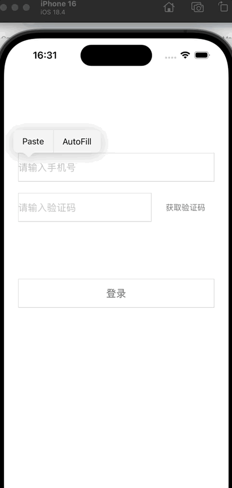
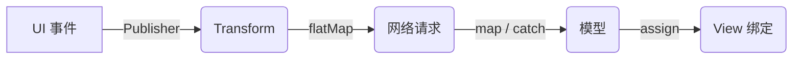

# 老项目登录模块的 **Combine + MVVM** 响应式改造实践

> 本文记录了我在维护一款多年前的 iOS App（**Swift + Objective‑C** 混编）时，如何把 **登录模块** 从传统 MVC + 命令式回调重构为 **Combine + MVVM** 响应式流， 本Demo以一个简单的登录页面为例进行说明。  

---
一个典型的登录界面，通常包括以下几个核心功能需求：
-   提示用户输入手机号；
-   支持获取验证码并触发倒计时逻辑；
-   实时验证手机号与验证码的合法性；
-   根据输入内容动态控制“提交”按钮的可点击状态；
-   提交时需校验用户是否已勾选隐私协议；
-   发起登录请求并处理返回结果

在传统的 MVC 架构中，这些功能往往通过分散的回调和状态标志来管理，业务逻辑杂糅在 Controller 中，导致代码耦合度高、状态同步复杂且容易引发 bug。
本文以这个简单但完整的登录流程为例，利用一个简单的登录页面，介绍如何通过 Combine + MVVM 的响应式编程方式进行重构，将输入响应、状态变更、网络请求与 UI 行为解耦，提高代码可读性与可维护性。



## 目录
1. [痛点与目标](#痛点与目标)  
2. [整体思路](#整体思路)  
3. [关键改造点](#关键改造点)  
   1. [UITextField ➜ Publisher](#uitextfield-➜-publisher)  
   2. [UIControl 事件流](#uicontrol-事件流)  
   3. [网络请求包装](#网络请求包装)  
   4. [弹窗流化](#弹窗流化)  
   5. [验证码倒计时](#验证码倒计时)  
4. [完整示例：按钮点击到登录完成](#完整示例按钮点击到登录完成)  
5. [迁移心得](#迁移心得)  
6. [总结](#总结)

---

## 痛点与目标

| 旧实现                                 | 带来的问题           |
|---------------------------------------|----------------------|
| **回调、通知、代理混用**              | 代码分散、调试困难   |
| **ViewController 既管 UI 又管网络**   | 逻辑耦合，测试困难   |
| **多层嵌套异步**（网络→弹窗→再次网络）| 回调地狱，状态同步难 |
| **手动刷新 UI**                       | 易漏更新、竞态风险   |

### 改造目标
1. **所有离散事件**（文本输入、按钮点击、网络回包、弹窗结果…）统一抽象为 **Publisher 数据流**。  
2. 用 **高阶算子** 在声明式管道里描述业务链路，主线程只负责渲染 UI。  
3. 以 **MVVM** 隔离副作用，提升可测试性，并为后续 SwiftUI 迁移铺路。  

---

## 整体思路



1. **封装**：为 UIKit 控件、网络层、弹窗各写 Combine 适配。  
2. **组合**：`map / filter / flatMap / catch` 描述业务分支与异常恢复。  
3. **绑定**：`assign / sink` 将数据驱动 UI，彻底告别手动 `reloadData()`。  

---

## 关键改造点

> 以下每节先给核心代码，再拆解背后 *Combine 语义*、*线程模型*、*资源释放* 等细节，方便在项目中举一反三。

### UITextField ➜ Publisher

```swift
extension UITextField {
    var textPublisher: AnyPublisher<String, Never> {
        NotificationCenter.default
            .publisher(for: UITextField.textDidChangeNotification, object: self)
            .compactMap { ($0.object as? UITextField)?.text }
            .eraseToAnyPublisher()
    }
}
```

**要点**  
1. `NotificationCenter` 方案避免占用 `delegate`。  
2. `compactMap` 抹平 Optional，保证下游拿到稳定 `String`。  
3. 对外暴露 `AnyPublisher<String, Never>`，实现可替换。  
4. 如需实时格式校验，上游可 `debounce` 防抖。  
5. 通知本就发生在主线程；若后台处理后需更新 UI，请 `receive(on: RunLoop.main)`。  

**示例 —— 动态控制登录按钮状态**

```swift
let phone = phoneField.textPublisher.prepend("").removeDuplicates()
let code  = codeField.textPublisher .prepend("").removeDuplicates()

Publishers.CombineLatest(phone, code)
    .map { !$0.0.isEmpty && !$0.1.isEmpty }
    .receive(on: RunLoop.main)
    .assign(to: \.isEnabled, on: loginButton)
    .store(in: &cancellables)
```

---

### UIControl 事件流

```swift
extension UIControl {
    func publisher(for events: UIControl.Event) -> AnyPublisher<Self, Never> {
        UIControlPublisher(control: self, events: events).eraseToAnyPublisher()
    }
}
```

**要点**  
1. 自定义 `Subscription` 绑定 Target–Action；`cancel()` 时移除 target，防泄漏。  
2. Publisher 输出控件本身，方便下游读取属性。  
3. 泛型 `Self` 保留静态类型信息。  
4. UIKit 事件总在主线程，无需额外调度。  
5. 统一事件源，取代散落的 Target–Action。  

---

### 网络请求包装

`NetWork.swift` 方便演示，采用本地 `userInfo.json` 作为数据，借 `Future` 返回模型。

```swift
enum ErrorCode: Int, Codable { case Success = 0; case Failed = -1 }

struct ApiCustomResponse<T: Codable>: Codable {
    var code: ErrorCode = .Failed
    var message: String?
    var data: T?
}

class NetWork {
    static func request<T: Codable>(_ type: T.Type = T.self) -> AnyPublisher<T, Never> {
        Future { promise in
            guard let url = Bundle.main.url(forResource: "userInfo", withExtension: "json"),
                  let data = try? Data(contentsOf: url),
                  let model = try? JSONDecoder().decode(type, from: data) else {
                promise(.success(NetWork.makeErrorModel(nil))) // 占位错误模型
                return
            }
            promise(.success(model))
        }.eraseToAnyPublisher()
    }

    static func makeErrorModel<T: Codable>(_ error: Error?) -> T { fatalError() }
}
```

**要点**  
- Failure 设为 `Never`，错误通过占位模型返回，链路更简洁。  
- 将来接入真实接口，只需把 `Future` 替换为 `URLSession.dataTaskPublisher`。  

---

### 弹窗流化

```swift
AlertView
    .show(text: "请同意《用户协议》和《隐私政策》", parentView: self.view)
    .filter { $0 > 0 }                 // 1=确认, 0=取消
    .handleEvents { _ in self.agreementBtn.isSelected = true }
    .flatMap { self.validateSignal() } // 进入下一步校验
    .eraseToAnyPublisher()
```

**要点**  
- `AlertView` 返回 `Int`（0/1），无需额外枚举。  
- `handleEvents` 集中副作用，链路清晰。  
- `flatMap` 将弹窗与输入校验串成单一数据流。  

---

### 验证码倒计时

外部注入 `action`，仅在点击时判断：

```swift
captcha.action = Deferred { [weak self] in
    self?.phoneTextField.text?.isEmpty == true ?
        Just(-1 as Any) :
        Just(0 as Any)
}.eraseToAnyPublisher()
```

`CaptchaView.bind()` 关键流：

```swift
tapSubject
    .flatMap { [weak self] _ -> AnyPublisher<Any, Never> in
        guard let self = self, let action = self.action else {
            return Just(-1).eraseToAnyPublisher()
        }
        return action
    }
    .compactMap { $0 as? Int }
    .filter { $0 != -1 }
    .handleEvents { _ in /* Toast: 发送成功 */ }
    .flatMap { [weak self] _ -> AnyPublisher<Int, Never> in
        guard let self = self else { return Empty().eraseToAnyPublisher() }
        let start = self.count
        return Timer.publish(every: 1, on: .main, in: .common)
            .autoconnect()
            .scan(start) { $0 - 1 }
            .prepend(start)
            .prefix(while: { $0 >= 0 })
            .eraseToAnyPublisher()
    }
    .receive(on: RunLoop.main)
    .sink { [weak self] left in
        guard let self = self else { return }
        if left == 0 {
            self.captchaBtn.isEnabled = true
            self.captchaBtn.setTitle("重新获取", for: .normal)
            self.captchaBtn.setAttributedTitle(nil, for: .normal)
        } else {
            self.captchaBtn.isEnabled = false
            let attr = NSAttributedString(string: "\(left)s",
                                          attributes: [.font: UIFont.systemFont(ofSize: 14)])
            self.captchaBtn.setAttributedTitle(attr, for: .normal)
            self.captchaBtn.setTitle(nil, for: .normal)
        }
    }
    .store(in: &cancellables)
```

**关键点**

| 步骤 | 价值 |
|------|------|
| 1. `tapSubject` | 手动触发点击流，易插入前置校验 |
| 2. `Deferred` `action` | 点击时才校验手机号，协同 `filter -1` |
| 3. `Timer.publish + scan` | 纯 Combine 倒计时，无 GCD |
| 4. `prepend` | 立即推送初始值 60 |
| 5. `prefix` | 倒计完自动完成，释放资源 |
| 6. UI 更新集中于 `sink` | 文案/使能逻辑统一 |

---

## 完整示例按钮点击到登录完成

```swift
submitButton.publisher(for: .touchUpInside)
    .handleEvents { [weak self] _ in self?.view.endEditing(true) }
    .flatMap { [weak self] _ in self?.validateSignal() ?? Empty().eraseToAnyPublisher() }
    .flatMap { NetWork.request(ApiCustomResponse<UserModel>.self) }
    .compactMap(\.data)
    .assign(to: \.userModel, on: viewModel)
    .store(in: &cancellables)
```

---

## 迁移心得
- 流只描述数据，副作用集中在 `handleEvents / sink`。  
- `@Published` + `assign` 完成 View ↔ ViewModel 双向绑定，单测更容易。  
- 统一在生命周期钩子清空 `AnyCancellable`，不再散落移除观察者。  

---

## 总结
Combine + MVVM 为老 UIKit 项目注入新活力，也为 SwiftUI 铺路

