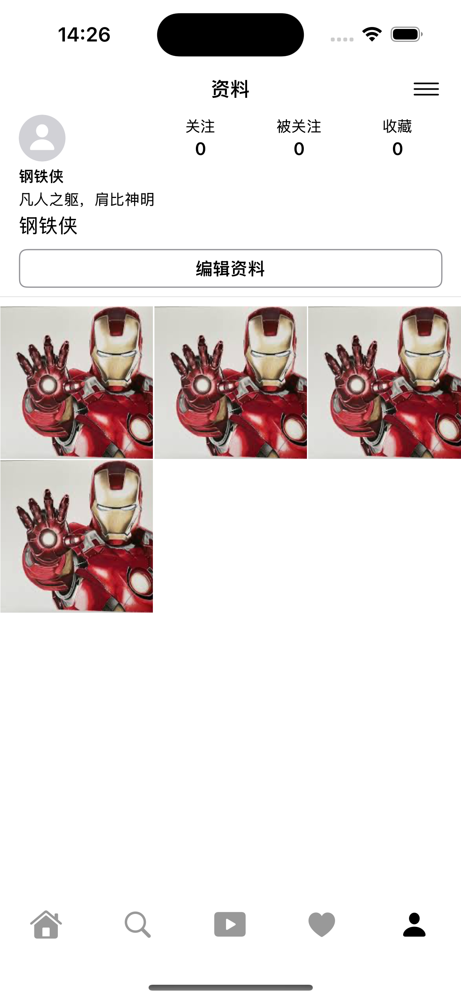
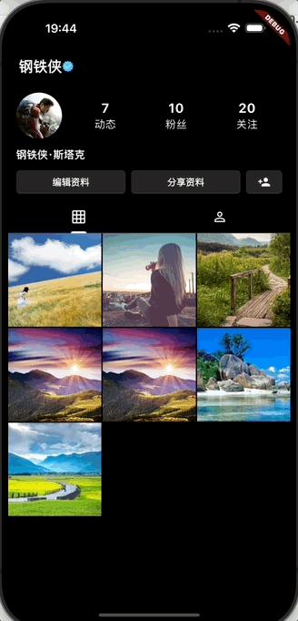
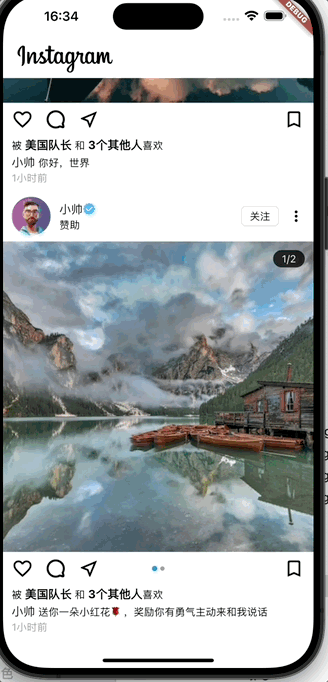

# 🚀 Flutter × iOS Cross-Platform Demo Collection / Flutter × iOS 跨平台实战 Demo 集合

**EN**  
A curated collection of demos showcasing **Flutter cross-platform development** and **iOS native (Swift / SwiftUI)** best practices.  
Each demo features:  
- A detailed technical article (hosted on Juejin)  
- Preview screenshots or GIF animations  
- Key implementation highlights for learning and reuse  

---

**中文**  
本仓库收录了我在 **Flutter 跨平台开发** 与 **iOS 原生开发**（Swift、SwiftUI）中的一些实践 Demo，涵盖从 UI 交互到工程架构的多方面案例。  
每个 Demo 均配有：  
- 对应的详细说明文档（掘金）  
- 截图或动图展示  
- 关键实现与技术要点  

---

## 📚 Directory / 目录

### 1. iOS Native Development / iOS 原生相关
| Demo | 技术点 / Key Points | 文档链接 / Article | 预览 / Preview |
|------|--------------------|--------------------|----------------|
| **Demo1** - 登录模块的 *Combine + MVVM* 响应式改造实践 | Combine, MVVM | [说明文档](https://juejin.cn/post/7510477725477912630) |  |
| **Demo2** - 深入理解 Swift Codable：从基础到进阶 | Codable serialization/deserialization | [说明文档](https://juejin.cn/post/7512720387718725659) | — |
| **Demo3** - 崩溃日志手动符号化小记 | Crash log symbolication | [说明文档](https://juejin.cn/post/7515377033868361738) | — |
| **Demo4** - RxSwift 中的 PriorityQueue | RxSwift, Data structures | [说明文档](https://juejin.cn/post/7517916583731396645) | — |
| **Demo9** - SwiftUI 打造 TikTok 风格的滑动短视频播放器 | SwiftUI, Video player | [说明文档](https://juejin.cn/spost/7533641415130644489) |  |
| **Demo12** - 基于TCA构建Instagram克隆：SwiftUI状态管理的艺术 | SwiftUI, TCA | [说明文档](https://juejin.cn/spost/7541297764710924334) | &ensp;&ensp;&ensp; |

---

### 2. Flutter Cross-Platform Development / Flutter 跨平台相关
| Demo | 技术点 / Key Points | 文档链接 / Article | 预览 / Preview |
|------|--------------------|--------------------|----------------|
| **Demo5** - 用 *Very Good CLI × Bloc × go_router* 搭好 Flutter 工程地基 | Project scaffolding, State management, Routing | [说明文档](https://juejin.cn/post/7523246240474513418) |  |
| **Demo6** - Flutter 弹窗解析：从系统 Dialog 到自定义 | Dialog, Custom UI | [说明文档](https://juejin.cn/post/7525711687703691315) | &ensp;&ensp;&ensp; |
| **Demo7** - NestedScrollView + SliverAppBar 打造关注/粉丝列表（结合 Bloc） | Sliver widgets, State management | [说明文档](https://juejin.cn/post/7528344720075161610) |  |
| **Demo8** - Flutter 个人主页实践笔记 | UI architecture, Bloc | [说明文档](https://juejin.cn/post/7530993789634805769) |  |
| **Demo10** - 类 Instagram 的 Feed 列表页 | ListView, UI animations | [说明文档](https://juejin.cn/post/7536119661534347310) | &ensp;&ensp; |
| **Demo11** - 类 TikTok 的竖向滑动短视频播放器 | Video playback, Scroll interaction | [说明文档](https://juejin.cn/spost/7538642318317076499) | &ensp; |

---

## 🛠 Tech Keywords / 技术关键词
- **Flutter Cross-Platform Development**: Bloc, go_router, Custom Dialog, NestedScrollView, SliverAppBar, Video playback  
- **iOS Native Development**: Combine, MVVM, Swift Codable, RxSwift, SwiftUI  
- **Tools & Engineering**: Very Good CLI, Crash log symbolication, PriorityQueue implementation  

---

## 📌 Notes / 说明
- 所有预览均为**可点击缩略图**（点击查看大图）。  
- 建议：GIF 用 `width="140~160"`，PNG/JPG 用 `width="110"`，通过 `&ensp;` 控制横向间距，保证 3–4 列并排更整齐。  
- 如需进一步减小 README 体积，可用轻量版 GIF/PNG 作为缩略图，点击后跳转到原图/高清图。  
